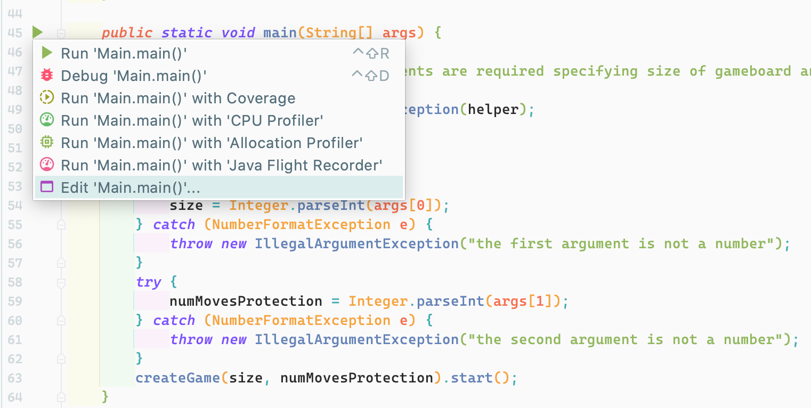

## Frequently Asked Questions

### Q1: How to specify program arguments when running main class in Intellij IDEA?

1. Open the Main class file in Intellij IDEA and find the main method.
2. Click the `▶` symbol on the left of main method. 
3. Select the `Edit 'Main.main()'...` in the context menu. This will open a window to create a run configuration.

</img>

4. In the opened window, set the `Name` of this run configuration and specify program arguments in `Program arguments
` textbox. Arguments are separated by space. After that, click `OK` to save the run configuration.

</img>

5. In the toolbar, select the run configuration you just created and run it by clicking the button `▶` in the toolbar.

</img>

More information can be found in [Intellij IDEA documentation](https://www.jetbrains.com/help/idea/run-debug-configuration-application.html). 

### Q2: How to run the sample tests?

1. Open the `Edit Configurations` window as shown in the below image.

</img>

2. In the opened window, click the `✛` button and select `Junit`.

</img>

3. On the right side, set the name, select `Test kind` as `All in directory` and then set the directory as `src/test
`. After that click `OK` to save the run configuration.

</img>

4. Run the created run configuration in the toolbar to run tests. 

More information can be found in [Intellij IDEA documentation](https://www.jetbrains.com/help/idea/run-debug-configuration-application.html). 

### Q3: How to get the code coverage of tests?

1. Select the run configuration of tests created in Q2. 
2. Click the `Run with Coverage` button in the toolbar.

</img>

3. After the running, a side window will show up with different types of coverage report. 

### Q4: Is there a required error handling format for invalid input of `ConsolePlayer`? 

No, since we do not use Exceptions in assignment 1, there is no error format for invalid inputs from console.
In the TA-only tests, we do not test the error message you print.
The thing you should do is to check whether the input is a valid input or not, if it is invalid, tell user to re-input. 
Note that the input format should be consistent with what is described in [README](README.md#basic-tasks), e.g. `a1->b3`. 
Inputs not complying to this format should also be considered invalid.

### Q5: Can I create other new methods or classes apart from the given ones? Can I import or use some extra library in the assignment? 

Yes, you are free to create new methods and classes or use any library, utility class or advanced features of Java. 
If you plan to use non-builtin packages or libraries, be sure to put the “jar” file of the external package or library
 in the “lib” folder, so that we can make your code work correctly when grading. 

### Q6: Why does the obfuscated version print a lot of corrupted characters like `?[34mK?[0m ?[34MA?[0m` in the output? 

This is mostly because you are using `Windows` and the `Command Prompt` and `PowerShell` on `Windows` can not
 recognize ANSI color in stdout. 
One simple workaround is to use the `Run Configuration` of IntelliJ. 
You can create a new [`Run Configuration`](https://www.jetbrains.com/help/idea/run-debug-configurations-dialog.html) of type: 
 [`JAR Application`](https://www.jetbrains.com/help/idea/run-debug-configuration-jar.html), as is shown below. 
 
 </img>

In the `Path to JAR`, select the path to `PA1_obfuscated.jar` file.
In the `Program arguments`, put the arguments of `PA1_obfuscated.jar`. 
Then you can click `OK` to save the `Run Configuration` and run it. 

In this way we run the `jar` file using IntelliJ console, which handles ANSI color correctly. 
